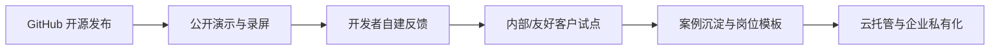

# OpenStaff（开源数字员工）商业计划书 v0.1

| 项 | 内容 |
| --- | --- |
| 产品工作名 | OpenStaff / 开源数字员工 |
| 版本 | v0.1 |
| 日期 | 2026-09-28（Asia/Shanghai） |
| 状态 | **评审稿** |
| 作者口径 | 京东金融科技 · AI 组织效能（Qian Liang） |
| 文档性质 | 立项前评审材料；定价与市场判断均为**假设**，非承诺 |

---

## 1. 一句话与愿景

**一句话**：OpenStaff 是面向组织提效的开源「数字员工操作系统」——以聊天为第一界面、多 Agent 协同、每人/每岗一台可审计的云端电脑，形态参考公开可见的 Grok Bot 交互范式，代码公开托管于 GitHub。

**愿景**：让「岗位数字员工」成为可复制、可验证、可审计的标准交付物——不是给人配助理话术，而是把产品经理、运营、研发协作等岗位能力沉淀为可部署的 Agent 运行时与技能库，在金融科技等高合规场景真正落地。

**产品主张（三条）**：

1. **岗位员工，而非通用闲聊**——每个 Agent 有人设、记忆、例程、技能与私有沙箱电脑。  
2. **验证闸门内建**——重要动作经审批卡片与审计日志；能闭环再立项/交付，不能则快速丢弃。  
3. **开源核心 + 可商业化外围**——核心运行时与协议开源；云托管实例、企业私有化与合规连接器可收费。

---

## 2. 问题与市场

### 2.1 组织侧痛点

| 痛点 | 表现 | OpenStaff 切入 |
| --- | --- | --- |
| Agent 试用碎片化 | 各团队自建脚本/单聊 Bot，无法沉淀为岗位资产 | 统一 Agent 侧栏、记忆、例程、技能库 |
| 不可审计 | 工具调用与外联网关行为难回溯 | 审批闸门 + 审计日志默认开启 |
| 形态分裂 | 云端沙箱与本地机器权限割裂 | 云端实例 + 本地轻量客户端，混合编排 |
| 合规顾虑 | 金融科技等场景忌讳黑盒与「秘书」叙事 | 开源可审查 + 岗位数字员工口径 |

### 2.2 市场语境（定性，无编造规模数字）

- **组织提效**：大模型普及后，瓶颈从「会不会调 API」转向「如何把岗位流程产品化为可持续运行的数字员工」。  
- **数字员工品类**：相对通用 Copilot，买方更关心岗位模板、验证闭环、沙箱隔离与可运维性。  
- **为何开源**：协议与运行时开源降低采购与安全评审门槛；社区贡献 Skills/Connectors；商业化落在托管、私有化与合规增值——符合 Open Core 常识路径。  
- **假设**：早期采用者以「有 Agent 基建经验的研发团队 + 组织效能/数字化部门」为主；大规模业务条线采购需试点证据，不宜在 v0.1 夸大 TAM。

---

## 3. 产品定义与对标 Grok Bot

### 3.1 产品定义

OpenStaff = **开源数字员工 OS**，由三部分组成：

1. **本地客户端**（Rust）：轻量托盘 + 小窗口，聊天优先；可在用户授权下执行本机工具。  
2. **云端实例**（容器/K8s）：每个 Agent 可拥有隔离沙箱电脑、浏览器/桌面子代理、记忆与例程。  
3. **控制面**：会话路由、审批策略、连接器/MCP、多 Agent 协作（SendToAgent、频道/群组房）。

### 3.2 形态对齐表（公开可见交互范式参考，非逆向专有实现）

| 能力维度 | Grok Bot 公开可见范式（参考） | OpenStaff v0.1 对齐目标 |
| --- | --- | --- |
| 主界面 | 聊天优先，侧栏多 Agent | 同左；侧栏 Agents 为一级导航 |
| Agent 资产 | 人设、记忆、例程、技能 | Profile / Memory / Routines / Skills |
| 私有电脑 | 沙箱执行环境 + 浏览器/桌面使用 | 每 Agent 隔离沙箱（可复用 OpenClaw/K8s STS+PVC 思路） |
| 对用户通道 | 明确「对用户说话」的唯一出口类能力 | SendToUser 为对用户可见输出主通道 |
| 决策交互 | 反应、Widget、审批卡片 | Widget + Auto-review 类审批 |
| 语音 | 语音备忘录 | MVP 可先录音附上传，后补流式 |
| 多 Agent | 转发/协作 | SendToAgent + 频道/群组房 |
| 云/本地 | 云端 agent 做仓库工作；本地工具需审批 | 云端 Cloud Agents + 本地工具审批 |
| 开源边界 | （专有产品） | 核心协议与运行时开源；托管可商业化 |

> **声明**：本文仅参考公开可见的交互形态与产品分层表述，**不声称也不进行**对专有 Grok Bot 内部实现的逆向工程。

---

## 4. 开源策略与商业模式（Open Core）

### 4.1 开源边界（假设，待法务确认）

| 层级 | 许可倾向 | 内容 |
| --- | --- | --- |
| 核心 | Apache-2.0 或 MIT（二选一，立项后定） | 协议、本地客户端核心、Agent Runtime 基础能力、基础 MCP 适配 |
| 可选社区插件 | 同核心或兼容许可 | 官方维护的 Skills、示例岗位模板 |
| 商业层 | 专有 / 商业许可 | 托管控制面 SLA、企业 SSO/审计增强、托管合规连接器、高级配额与多租运维 |

### 4.2 收入模型（假设）

1. **云托管实例订阅**：按席位或按运行中的 Agent 实例计费。  
2. **企业私有化**：年费（软件许可 + 升级通道）；可选实施与培训。  
3. **支持与合规插件**：审计导出、密钥托管、网络策略模板、金融场景连接器打包。  
4. **Skills 市场（可选，后期）**：优质岗位技能抽成或企业内私有市场——**不作为 MVP 收入依赖**。

### 4.3 开源与商业的边界原则

- 自建部署必须能跑通「单用户多 Agent + 沙箱 + 审批」主路径，避免开源版沦为残缺演示。  
- 商业差异化放在：多租运维、SLA、合规连接器、企业身份与审计深度，而非锁死核心协议。

---

## 5. 目标客户与定价假设

> **以下全部为假设，用于评审讨论，不构成对外报价承诺。**

| 客群 | 交付形态 | 定价假设（示意） | 价值主张 |
| --- | --- | --- | --- |
| 个人开发者 / 开源贡献者 | 自建（自备模型与机器） | 免费（开源核心） | 可审计、可改、可贡献 Skills |
| 小团队 | 云托管 | 按席位或按实例订阅（假设：团队档） | 少运维、开箱多 Agent |
| 中大型企业 / 金融科技 | 私有化或专属云 | 年费 + 可选支持包（假设：企业档） | SSO、审计、网络策略、岗位模板与闸门 |

**不计费假设说明**：模型 API 费用默认由客户自带 Key 或走客户云账单；OpenStaff 商业报价不捆绑模型折扣承诺。

---

## 6. Go-to-market

1. **GitHub**：README、架构图、一键自建文档、Apache/MIT 许可、贡献指南。  
2. **演示**：5–8 分钟录屏——创建岗位 Agent → 交代任务 → Computer 执行 → 审批卡片 → Routine。  
3. **试点**：优先选「已有 Agent/OpenClaw/K8s 基建」的组织效能或研发效能团队；验收看验证闸门与审计，而非聊天噱头。  
4. **扩散**：岗位模板（产品经理/运营等）开源；金融科技叙事强调可落地与可审计。

---

## 7. 十二个月路线图（假设节奏）

| 阶段 | 时间假设 | 主题 | 交付物 |
| --- | --- | --- | --- |
| M0 | 月 0–2 | MVP | 本地客户端壳 + 控制面 API + 单 Agent 云沙箱 + 聊天/审批 |
| M1 | 月 2–4 | 多 Agent | 侧栏多 Agent、SendToAgent、基础记忆与 Skills |
| M2 | 月 4–6 | 例程与连接器 | Cron/事件例程、MCP 连接器框架、审计导出 |
| M3 | 月 6–9 | 岗位化 | 岗位模板、验证闸门产品化、云托管公测 |
| M4 | 月 9–12 | 企业就绪 | SSO、网络策略模板、私有化安装包、试点案例 |

里程碑可按仓库到位后的人力再压缩或拉长；本表仅供评审对齐预期。

---

## 8. 竞争格局（务实）

| 类型 | 代表 | 相对 OpenStaff | 我们的差异化 |
| --- | --- | --- | --- |
| 开源 Agent 运行时 | OpenClaw 等 | 偏 Gateway/运行时，交互 OS 未必完整 | 聊天优先多 Agent 桌面形态 + 云/本地一体 |
| 自建 Agent 脚本 | 各团队 LangChain/自研 | 灵活但难运维、难审计 | 产品化侧栏、审批、例程、沙箱生命周期 |
| 协作套件智能伙伴 | 飞书智能伙伴等 | 入口在 IM，沙箱与本机工具弱 | 独立数字员工 OS，私有电脑与本地审批 |
| 通用 Copilot | IDE/Office Copilot | 强在编码/文档，弱在岗位例程与多 Agent 沙箱 | 岗位数字员工 + 验证闸门 + 开源可审查 |
| 专有桌面助手 | Grok Bot 等 | 体验标杆，闭源 | 开源核心 + 可私有化 + 金融科技合规叙事 |

**务实结论**：不与「最大模型品牌」正面拼模型质量；拼 **可部署的岗位运行时、审批审计、开源可信**。可与 OpenClaw/K8s 生态协作乃至复用执行面，而非重复造容器编排轮子。

---

## 9. 风险与合规

| 风险 | 说明 | 缓释 |
| --- | --- | --- |
| 在职竞业与职务成果 | 作者/贡献者雇佣关系下的开源边界 | 立项前与法务/合规确认；公司批准的开源范围与贡献协议 |
| 模型供应 | 上游模型可用性、价格、区域限制 | 模型网关多后端；客户自带 Key；不绑单一供应商 |
| 账号与密钥安全 | 连接器 Token、浏览器登录态 | 密钥不进聊天；Secret 存保险库；本机工具默认审批 |
| 供应链 | 依赖漏洞、恶意 Skills | 依赖锁定与扫描；Skills 签名/审核（后期） |
| 叙事合规 | 金融场景忌讳不当自动化承诺 | 汇报口径坚持岗位数字员工 + 验证闸门；不做「无人值守金融决策」承诺 |
| 开源治理 | 贡献质量、商标与品牌 | CODEOWNERS、评审门禁、商标指南 |

---

## 10. 成功指标

> 指标为**方向性假设**，待试点基线后量化；此处不编造虚假转化率或收入数字。

| 阶段 | 指标方向 |
| --- | --- |
| 开源冷启动 | GitHub Star/Fork 趋势、Issue/PR 质量、自建成功 Issue 占比下降 |
| 产品可用性 | MVP 主路径完成率（创建 Agent→任务→审批→结果）、P1 缺陷关闭周期 |
| 试点价值 | 试点团队「验证闸门」使用次数、可审计任务占比、岗位模板复用次数 |
| 商业验证 | 云托管付费团队数（若上线）、私有化意向/POC 数——**有则记，无则不虚构** |

---

## 11. 下一步（等仓库后开工清单）

1. 确认 GitHub 组织/仓库名、许可证（Apache-2.0 vs MIT）、商标「OpenStaff」可用性。  
2. 初始化 monorepo（见技术计划）：`crates/`、`services/`、基础 CI。  
3. 冻结 MVP 范围：单云沙箱 + Rust 客户端壳 + 聊天/审批；明确砍掉项。  
4. 与法务确认开源贡献者协议及在职开源流程。  
5. 准备 1 份对外演示脚本与 1 个岗位模板（产品经理数字员工 + 验证闸门）。  
6. 评审本三件套（商业 / UX / 技术）→ 修订为 v0.2 → 再开开发迭代。

---

## 附录：术语与口径

| 使用 | 避免 |
| --- | --- |
| 岗位数字员工、数字员工 OS、验证闸门、可审计 | 「秘书」「首席秘书」等叙事 |
| 形态参考 / 公开可见交互范式 | 「兼容 Grok 协议」「逆向实现」 |
| 假设 / 评审稿 | 未经验证的市场规模与融资数字 |

---

*OpenStaff Business Plan v0.1 · 2026-09-28 · 评审稿*
