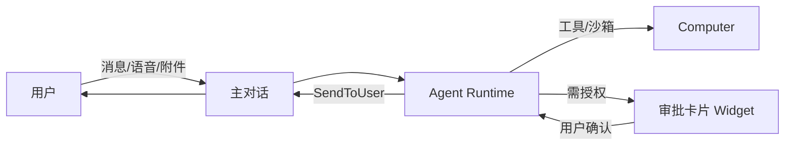
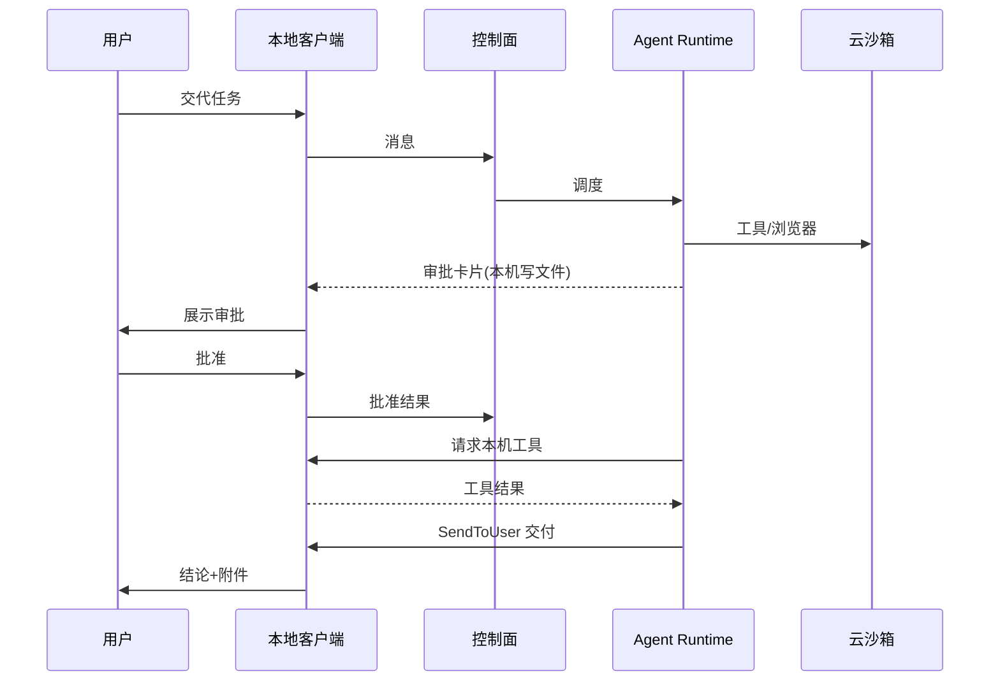

# OpenStaff（开源数字员工）产品与 UX 方案 v0.1

| 项 | 内容 |
| --- | --- |
| 产品工作名 | OpenStaff / 开源数字员工 |
| 版本 | v0.1 |
| 日期 | 2026-09-28（Asia/Shanghai） |
| 状态 | **评审稿** |
| 对标说明 | 形态参考 Grok Bot **公开可见交互范式**；不声称逆向专有实现 |
| 汇报口径 | 岗位数字员工、验证闸门、可审计；**不使用「秘书」叙事** |

---

## 1. 设计原则

OpenStaff 的交互以「数字员工操作系统」为目标，而不是又一款单聊窗口。下列原则与公开可见的 Grok Bot 形态对齐，并映射到可评审的产品规则。

| # | 原则 | 产品规则 |
| --- | --- | --- |
| 1 | **聊天是主舞台** | 用户默认落在对话；设置、电脑、例程都是「为完成对话任务而打开」的二级表面 |
| 2 | **SendToUser 是对用户唯一主通道** | Agent 对用户可见的自然语言、结论、附件入口，经统一「对用户发送」通道呈现；工具日志默认折叠，避免刷屏 |
| 3 | **反应与 Widget 承载决策** | 是/否、多选、表单、风险确认用 Widget；不只靠纯文本「请回复 Y/N」 |
| 4 | **Voice 是一等输入** | 语音备忘录可转为任务上下文；MVP 可先「录音→附件→转写」，再演进流式 |
| 5 | **端到端交付** | 用户交代目标后，应能在同一会话看到：计划 → 电脑上的动作 → 审批 → 产物链接/附件，而不是被踢到五个后台页 |
| 6 | **验证闸门默认开启** | 高风险工具（本机写文件、外发、生产连接器）必须走审批卡片；金融科技场景不可默认静默执行 |
| 7 | **岗位感优先于萌宠感** | 人设服务岗位目标（产品经理/运营等）；UI 文案避免「秘书」「小助手卖萌」主叙事 |



---

## 2. 信息架构

### 2.1 一级导航（侧栏 + 主区）

```text
┌─────────────┬──────────────────────────────────────────┐
│  Agents     │  主区：Chat（默认）                         │
│  · 产品经理 │  ┌────────────────────────────────────┐  │
│  · 运营专家 │  │ 消息流 / Widget / 语音气泡 / 附件    │  │
│  · …        │  └────────────────────────────────────┘  │
│  [+] 新建   │  次级页签（按需）：Computer | Routines |   │
│             │  Skills | Connectors | Memory            │
│  ─────────  │                                          │
│  Channels   │                                          │
│  Settings   │                                          │
└─────────────┴──────────────────────────────────────────┘
```

| 模块 | 职责 | 备注 |
| --- | --- | --- |
| **Agents** | 多 Agent 列表；每人设、状态（在线/忙碌/等待审批） | 点击切换会话上下文 |
| **Chat** | 主对话、线程、Widget、语音、附件 | 默认落地页 |
| **Computer** | 该 Agent 沙箱桌面/终端/文件只读浏览或受控操作 | 云端实例为主；本地工具另标「本机」 |
| **Routines** | Cron + 事件监听器；启停与最近运行 | 与聊天双向跳转（「由例程触发」标签） |
| **Skills** | 技能库：安装、启用、版本、权限声明 | 岗位模板即 Skills + Prompt + 闸门策略包 |
| **Connectors** | MCP/OAuth/API 连接器；范围与密钥状态 | 密钥永不进聊天明文 |
| **Memory** | Profile（长期人设）+ Log（会话/事件摘要） | 用户可编辑/遗忘 |
| **Settings** | 账号、模型路由、审批策略、外观、更新 | 云端与本地差异见 §6 |
| **Channels** | 多 Agent 群组房 / 频道 | M1+；MVP 可仅私聊 + SendToAgent |

### 2.2 Agent 对象模型（用户可感知）

每个 Agent 对外呈现为「一位岗位数字员工」，具备：

- **Persona**：名称、岗位职责、说话风格、禁区  
- **Memory**：Profile + 可检索日志  
- **Routines**：定时与事件驱动  
- **Skills**：可插拔能力包  
- **Computer**：私有沙箱（云）及可选本机工具通道  
- **Connectors**：已授权的外部系统  

---

## 3. 核心用户旅程

### 3.1 创建 Agent

1. 点击「新建」→ 选岗位模板（或空白）。  
2. 填写名称、职责、模型偏好（可后设）。  
3. 系统创建云端沙箱（或排队）→ 侧栏出现 Agent，状态「准备中→就绪」。  
4. 首条系统消息引导：交代第一个任务 / 打开 Computer / 配置 Connectors。

### 3.2 交代任务（主路径）

1. 用户在 Chat 用文字或语音说明目标与约束。  
2. Agent 回复简短计划（可折叠细节）。  
3. 需要工具时：沙箱内执行；涉及本机或高风险则弹出**审批卡片**。  
4. 完成后经 **SendToUser** 交付：结论 + 附件/链接 + 可选「打开 Computer 查看」。

### 3.3 看 Computer

1. 从会话内入口或顶栏进入 Computer 视图。  
2. 看到该 Agent 沙箱：终端输出、浏览器画面（若启用）、工作区文件。  
3. 用户可只读观察；写操作仍建议走对话意图或显式审批，避免「静默改生产」。

### 3.4 设 Routine

1. 用户：「每个工作日 9:00 汇总行业动态」。  
2. Agent 生成例程草案 Widget（Cron 表达式人话化 + 技能选择）。  
3. 用户确认 → Routines 列表可见 → 下次触发在 Chat 以「例程」标签出现线程。

### 3.5 多 Agent 协作

1. 用户对 Agent A：`请把竞品摘要发给运营专家`。  
2. A 调用 **SendToAgent** → B 侧栏有未读；B 处理后可回传 A 或经 SendToUser 汇总给用户。  
3. 复杂协作进 **Channel（群组房）**：多 Agent + 用户同通道（M1+）。

### 3.6 本地 + 云端混合

1. 云端 Agent 做仓库克隆、长任务、浏览器调研（笔记本关闭仍可跑——取决于托管策略）。  
2. 需触碰用户本机文件/应用时：本地客户端弹出审批 → 用户确认 → 短时授权执行 → 结果回传会话。  
3. UI 明确标注动作发生在「云端电脑」还是「本机」，避免权限误解。



---

## 4. 交互流细则

### 4.1 主对话

- 气泡分区：用户 / Agent（SendToUser）/ 系统（例程触发、成员变更）/ 工具摘要（默认折叠）。  
- 流式输出可中断；中断后状态为「已停止」，不自动续跑高风险工具。  
- 支持消息内引用附件、Computer 路径、历史 Widget 结果。

### 4.2 线程

- 长任务或例程触发可开子线程，避免主时间线被刷屏。  
- 主会话保留「进行中任务」胶囊，一键跳入线程。

### 4.3 语音

- MVP：按住录音 → 生成语音备忘录气泡 → 可选自动转写进上下文。  
- 非目标（MVP）：全双工实时语音通话、打断式多模态会议。

### 4.4 附件

- 拖拽/粘贴图片、PDF、代码、表格；上传至对象存储，消息内仅存引用。  
- Agent 产物（报告、补丁、截图）同样以附件或 Computer 路径交付。

### 4.5 审批卡片（Auto-review 类）

| 字段 | 说明 |
| --- | --- |
| 动作摘要 | 一句话：将在何处执行什么 |
| 风险级 | 低/中/高（策略引擎标注） |
| 详情 | 命令、路径、目标 URL、连接器范围（可展开） |
| 操作 | 批准一次 / 拒绝 / 批准并记住同类（可选，谨慎） |
| 超时 | 默认拒绝或挂起（可配置）；超时需可见提示 |

**原则**：审批 UI 由客户端渲染；Agent 不得用纯文本伪造「已批准」。

---

## 5. 数字员工岗位模板与验证闸门产品化

### 5.1 岗位模板（示例，可扩展）

| 模板 | 目标 | 预装 Skills（示意） | 默认闸门 |
| --- | --- | --- | --- |
| 产品经理数字员工 | 碎片洞察→验证→立项/需求草稿 | 竞品检索、文档起草、数据问数（只读） | 外发文档、写生产需求系统需审批 |
| 产品运营数字员工 | 活动/指标追踪与周报 | 表格汇总、看板只读、通报草稿 | 群发消息、改配置需审批 |
| 研发协作数字员工 | 仓库理解、PR 摘要、CI 解读 | Git 只读、Issue 摘要 | Push、生产部署连接器默认拒绝或强审批 |

> 模板是「Persona + Skills + Routines 草案 + 闸门策略」打包，不是换皮聊天机器人。

### 5.2 验证闸门产品化

对齐组织内「验证过滤闭环」叙事：

1. **接入**：用户丢入碎片想法/链接/数据线索。  
2. **协同**：可 SendToAgent 拉取舆情、轨迹、数仓、策略等岗（有连接器才启用）。  
3. **闸门 Widget**：「是否具备数据支撑的逻辑闭环？」→ 通过则生成立项/需求产物；不通过则标记丢弃并留审计。  
4. **审计**：每次闸门决定写入 Memory Log，支持导出。

金融科技落地要点：闸门是产品功能，不是文案口号；默认策略偏保守。

---

## 6. 云端实例 vs 本地客户端：体验差异与同步模型

| 维度 | 云端实例 | 本地客户端 |
| --- | --- | --- |
| 长任务 | 可在用户离线后继续（托管策略允许时） | 依赖本机开机与进程常驻 |
| Computer UI | 完整沙箱桌面/浏览器可视化 | 本机无「第二桌面」时，以工具结果与日志为主 |
| 工具权限 | 沙箱网络策略 + 出站白名单 | OS 权限 + 逐次审批 |
| 敏感文件 | 默认不碰用户个人盘 | 显式授权路径 |
| 更新 | 服务端滚动 | 客户端自动更新通道 |

**同步模型（假设）**：

- **真源**：会话、记忆、例程、技能配置在控制面；本地缓存可离线读最近会话。  
- **本地执行结果**：回传控制面后进入同一消息时间线。  
- **冲突**：同一 Agent 不允许多客户端并发写同一高风险工具会话（MVP：单活跃客户端租约）。

---

## 7. MVP 交互范围（砍什么）

### 7.1 MVP 必做

- 侧栏单/多 Agent（至少一个云沙箱跑通）  
- 主对话 + 附件 + 审批卡片  
- Computer 只读观察（终端/文件列表即可，完整 VNC 可降级）  
- 基础 Persona / 简单 Memory（Profile 文本）  
- 本地客户端：登录、聊天、审批、托盘常驻  

### 7.2 MVP 可砍或降级

| 项 | MVP 策略 |
| --- | --- |
| 完整桌面 CU / 有头浏览器画面 | 可先 headless + 截图附件 |
| 群组房 Channels | 仅 SendToAgent 私聊转发 |
| 流式实时语音 | 仅语音备忘录 |
| Skills 市场 UI | 本地/仓库级 Skills 目录即可 |
| 复杂 Memory 检索 UI | Profile 编辑 + 最近日志列表 |
| 精美 Widget 搭建器 | 固定几种：确认、单选、表单 |

---

## 8. 非目标（不做什么）

1. **不做**以「秘书」为主品牌的消费级陪伴产品。  
2. **不做**无审批的本机静默操控（默认拒绝）。  
3. **不做**承诺替代持牌金融决策或自动放贷。  
4. **不做**重型 Electron 巨型套壳作为唯一客户端方案（见技术计划；允许极薄 WebView，但以轻量为约束）。  
5. **不做** MVP 阶段的应用商店式商业运营后台。  
6. **不声称**二进制兼容或协议兼容任何专有桌面助手。  

---

## 9. 评审检查清单（给产品/设计）

- [ ] 主路径能否在 3 分钟演示内讲清：创建→任务→审批→交付  
- [ ] SendToUser 与工具日志是否在信息架构上分离  
- [ ] 岗位模板是否带闸门策略，而非仅 Prompt  
- [ ] 云/本机权限提示是否在每次高风险动作可见  
- [ ] 文案是否避开禁用叙事词  

---

*OpenStaff Product & UX v0.1 · 2026-09-28 · 评审稿*
