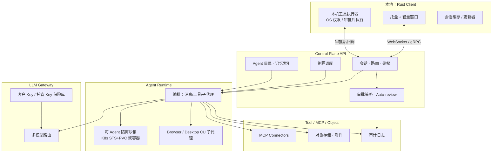

# OpenStaff（开源数字员工）技术计划 v0.1

| 项 | 内容 |
| --- | --- |
| 产品工作名 | OpenStaff / 开源数字员工 |
| 版本 | v0.1 |
| 日期 | 2026-09-28（Asia/Shanghai） |
| 状态 | **评审稿** |
| 许可证假设 | 核心 Apache-2.0 或 MIT（待定） |
| 对标说明 | 架构形态参考公开可见的多 Agent 桌面助手范式；**不进行**专有实现逆向 |

---

## 1. 总架构

### 1.1 逻辑架构（Mermaid）



### 1.2 分层职责

| 层 | 职责 | 非职责 |
| --- | --- | --- |
| 本地客户端 | UI、本机工具、审批展示、自动更新 | 长任务真源、多租编排 |
| 控制面 | 鉴权、会话、策略、调度、Agent 元数据 | 模型权重托管（除非企业另购） |
| Agent Runtime | 工具循环、子代理、沙箱生命周期配合 | 替代 K8s 成为第二套集群操作系统 |
| LLM Gateway | 统一出站、限流、路由、审计关联 ID | 训练基座模型 |
| Tool/MCP | 外部系统与技能 | 密钥明文进 Prompt |

---

## 2. 仓库 Monorepo 建议结构

```text
openstaff/
├── README.md
├── LICENSE                     # Apache-2.0 或 MIT
├── Cargo.toml                  # workspace
├── crates/
│   ├── client/                 # 本地 Rust 客户端（UI + 托盘 + 本机工具）
│   ├── protocol/               # 消息、事件、审批、工具调用的 IDL / 类型
│   ├── runtime-agent/          # Agent 编排核心库（可被服务端复用）
│   └── common/                 # 错误类型、配置、telemetry 辅助
├── services/
│   ├── api/                    # Control Plane API（HTTP/gRPC + WS 网关）
│   ├── scheduler/              # Cron / 事件例程
│   └── gateway/                # LLM Gateway（可与 api 同进程起步，后拆）
├── deploy/
│   ├── k8s/                    # STS+PVC、NetworkPolicy 示例
│   └── compose/                # 本地开发一键
├── skills/                     # 示例 Skills 与岗位模板（开源）
├── web/                        # 可选：薄管理控制台（非主客户端）
└── docs/                       # 架构、安全、贡献指南
```

**原则**：协议优先（`protocol` crate 为契约中心）；客户端与运行时共享类型，避免 JSON 随口约定漂移。

---

## 3. 本地客户端（Rust）

### 3.1 为何 Rust

- **性能与体积**：常驻托盘内存占用可控，避免重型 Electron 运行时成为默认负担。  
- **系统亲和**：本机工具、文件、权限、自动更新与 OS API 集成更直接。  
- **安全基线**：内存安全有助于降低本地执行器漏洞面（仍需安全审计，不神话语言）。  
- **单一语言栈假设**：协议库与客户端同语言，减少跨语言 IDL 摩擦（服务端可用 Rust 或后期 polyglot，MVP 倾向统一）。

### 3.2 进程模型

```text
openstaff-client
├── 主进程：托盘 + 窗口生命周期 + 与控制面长连接
├── UI 表面：优先原生 GUI 或极薄 WebView（仅渲染聊天壳）
└── 工具辅助进程（可选）：降权执行本机工具，崩溃隔离
```

| 选型约束 | 说明 |
| --- | --- |
| 避免重型套壳 | 不以「完整 Chromium + Node」作为唯一架构；若用 WebView，限制为薄渲染层 |
| 窗口 | 小窗口聊天优先；Computer 深视窗可后期或系统浏览器打开只读页 |
| 托盘 | 常驻、未读徽章、审批待办入口 |

### 3.3 与云端协议

- **控制通道**：WebSocket（MVP）或 gRPC streaming（可并行原型）；载荷为 `protocol` 定义的事件信封。  
- **鉴权**：设备级 refresh + 短时 access；企业场景预留 OIDC。  
- **心跳与租约**：单 Agent 本机工具租约，防多客户端并发写。

### 3.4 本地工具执行与 OS 权限

- 工具白名单（读文件、列目录、受控 shell…）在客户端配置，**默认拒绝**未声明工具。  
- 每次执行绑定审批 ticket ID；无 ticket 则拒执行。  
- macOS/Windows/Linux 权限差异用适配层；文档写清各平台能力矩阵。

### 3.5 自动更新

- 签名更新包 + 渠道（stable/beta）。  
- 更新器与主进程分离，失败可回滚上一版本。  
- 开源版可提供「自建更新源」配置。

---

## 4. 云端

### 4.1 控制面

- **API 服务**：Agent CRUD、会话、消息投递、审批决策写回、连接器配置（密钥写 Secret，不回显）。  
- **状态机**：Agent/Instance：`Provisioning → Ready → Busy → AwaitingApproval → Failed/Suspended`。  
- **多租假设**：开源单租可跑；商业层再加强隔离与配额账本。

### 4.2 按 Agent 的隔离沙箱（参考既有 OpenClaw / K8s 思路）

> 参考组织内已有讨论：**一数字员工实例 ≈ StatefulSet(replicas=1) + PVC**；控制面调 K8s API，而非过早自建重 Operator。此为**可复用思路**，OpenStaff 开源版亦可用 Docker Compose 单机等价物降低门槛。

| Profile | 建议形态 | 用途 |
| --- | --- | --- |
| `cli` | STS+PVC 或单容器+卷 | 仓库、脚本、文件产物 |
| `browser_headless` | 同上，资源上浮 | 无头浏览与截图 |
| `desktop_cu` | 独立节点池 + 污点（若有集群） | 有头桌面；MVP 可不出 |

**网络**：NetworkPolicy 默认拒绝，仅放行 LLM Gateway、对象存储、已声明连接器出口。  
**身份**：Pod 内 SA ≠ 控制面 SA；禁止挂集群管理员凭证。

### 4.3 例程调度

- `scheduler` 服务解析 Cron 与事件订阅（例如：仓库 webhook、日历——事件源可后置）。  
- 触发时投递「例程消息」入会话，带 `routine_id`，由 Runtime 走同一工具与审批策略。  
- 避免在沙箱内自建 crontab 真源，防止漂移。

### 4.4 记忆存储

| 类型 | 存储假设 | 备注 |
| --- | --- | --- |
| Profile | DB（Postgres 等） | 用户可编辑 |
| 会话消息 | DB + 冷热分层可选 | 附件仅存对象存储引用 |
| 检索型记忆 | MVP 可延后；可用简单全文或向量插件 | 非 MVP 阻塞项 |
| 沙箱工作区 | PVC / 卷 | 与记忆逻辑分离 |

### 4.5 对象存储附件

- 上传走预签名 URL；消息体只含 `attachment_id`。  
- 病毒扫描与 MIME 白名单（企业可强制）。  

---

## 5. 协议与事件模型

### 5.1 信封（逻辑字段）

```text
EventEnvelope {
  event_id, trace_id, ts,
  agent_id, session_id, thread_id?,
  actor: user | agent | system | tool,
  kind: message | tool_call | tool_result | approval_request
        | approval_decision | subagent_event | routine_fire | send_to_agent,
  payload: ...
}
```

### 5.2 关键消息

- `role` + `parts[]`（text / image_ref / voice_ref / widget）。  
- Agent 对用户可见部分标记 `channel: send_to_user`。

### 5.3 工具调用

- `tool_name`, `args`, `sandbox: cloud|local`, `risk_level`。  
- 结果：`ok|error` + 结构化摘要 + 可选附件引用。

### 5.4 审批

- `approval_request`：由策略引擎在工具执行前插入。  
- `approval_decision`：仅客户端/控制面可信主体可写；Runtime 校验签名或会话绑定。

### 5.5 子代理

- 父 Agent 发起 `subagent_event`（browser/desktop/repo-worker）。  
- 子代理不直接 SendToUser，除非策略允许；默认汇总回父 Agent。

### 5.6 SendToAgent

- 控制面写入目标 Agent 收件箱事件；权限：同用户作用域或显式共享策略。

---

## 6. 安全

| 主题 | 要求 |
| --- | --- |
| 密钥 | 不进聊天、不进 Prompt 明文、不进客户端日志；Secret 保险库或 K8s Secret + 引用 |
| 审批 | 高风险默认要审批；本机工具无 ticket 不执行；禁止模型「自批」 |
| 网络策略 | 沙箱出站最小权限；用户自定义连接器单独评估 |
| 审计日志 | 工具、审批、SendToAgent、连接器调用可导出；金融场景可只追加存储 |
| 供应链 | 依赖锁定、CI 扫描、发布签名 |
| 多租 | 开源 MVP 可单租；商业层租户 NS / 凭证隔离必须设计预留 |

---

## 7. 开源边界与第三方依赖

### 7.1 开源边界

| 开源（假设） | 商业可选 |
| --- | --- |
| protocol、client 核心、runtime-agent 基础循环 | 托管控制面 SLA、多租配额账本 |
| 示例 deploy（compose + 基础 k8s manifests） | 企业 SSO/SCIM、高级审计分析 |
| 示例 Skills / 岗位模板 | 托管合规连接器、官方支持 |

### 7.2 第三方依赖（方向性，非锁定选型会）

- **运行时**：容器 / Kubernetes。  
- **数据**：Postgres（控制面）、对象存储（S3 兼容）。  
- **可观测**：OpenTelemetry；Prometheus 指标（若已有集群习惯可对齐）。  
- **MCP**：官方 SDK / 社区传输层。  
- **UI**：Rust GUI 生态或薄 WebView——立项时做尖峰试验（spike），以包体与内存为验收门。  

不绑定单一模型厂商 SDK 为硬依赖；经 LLM Gateway 抽象。

---

## 8. MVP 技术里程碑与验收

| 里程碑 | 内容 | 验收（可演示） |
| --- | --- | --- |
| T0 | monorepo + protocol + CI 空跑 | 克隆后 `cargo test` / 基础检查通过 |
| T1 | Control Plane 最小 API + 假 Runtime | 客户端能登录并收发回声消息 |
| T2 | 真实沙箱（compose 单容器即可）+ 工具循环 | 对话中让 Agent 在沙箱写文件并回传 |
| T3 | 审批卡片端到端 | 本机或高风险工具弹出审批，拒绝则不执行 |
| T4 | 多 Agent 侧栏 + SendToAgent | 两个 Agent 完成一次转发与汇总 |
| T5 | 例程 Cron 触发 | 手动创建例程，到点出现带标签会话 |
| T6 | 打包与更新尖峰 | 至少一平台安装包 + 签名更新路径说明 |

**MVP 总验收口述**：开发者按文档自建 → 创建岗位 Agent → 交代任务 → 沙箱执行 → 审批 → SendToUser 交付附件。

---

## 9. 非目标与技术债声明

### 9.1 非目标（本阶段不做）

1. 自研重型 K8s Operator（先客户端调 API / compose）。  
2. 自训基座大模型。  
3. 完整有头 CU 集群调度与多租计费引擎。  
4. 以 Electron 全量复制浏览器桌面为唯一客户端。  
5. 兼容专有助手的私有二进制协议。

### 9.2 允许的技术债（显式登记）

| 债 | 理由 | 偿还触发 |
| --- | --- | --- |
| API 与 Gateway 同进程 | 降 MVP 运维复杂度 | 性能或发布节奏冲突时拆分 |
| Memory 无向量检索 | 岗位模板先靠 Profile + 日志 | 试点强烈要求语义回想 |
| Computer 仅日志/文件视图 | 减 VNC 复杂度 | 演示强依赖画面时再加 |
| 单活跃本机租约 | 避并发写 | 多设备同步需求明确后升级 |

技术债必须写入仓库 `docs/tech-debt.md`，禁止无登记扩散。

---

## 10. 与既有内部资产的关系（说明）

若组织内已有 OpenClaw Pod、JoyWorker 工厂或 STS+PVC 实践，OpenStaff **可选择**：

- **执行面复用**：Runtime 沙箱对接既有镜像与供给 API；或  
- **干净开源实现**：compose/社区 k8s 清单独立演进，避免把内部专有控制面泄入开源树。

许可证与代码隔离在仓库到位后由法务 + 架构联合裁定；本评审稿只要求「边界可切」。

---

## 11. 下一步（仓库就绪后）

1. 选定许可证与 crate/服务命名。  
2. 完成 UI 技术尖峰（原生 vs 极薄 WebView）并写一页结论。  
3. 冻结 `protocol` 首版事件枚举。  
4. 落地 T0–T3，再评是否插入 desktop_cu。  
5. 安全清单：密钥路径、审批、NetworkPolicy 样例合入 `deploy/`。  

---

*OpenStaff Tech Plan v0.1 · 2026-09-28 · 评审稿*
