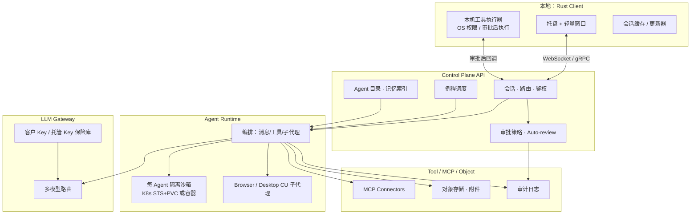
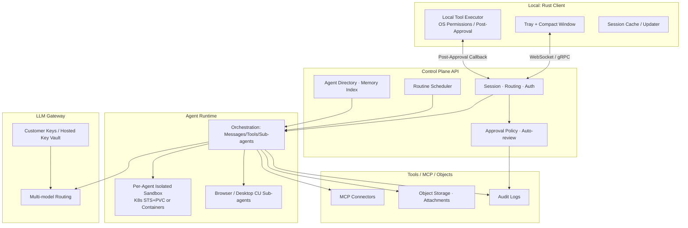

# OpenStaff 架构概览 / Architecture Overview

[English](#english) | [中文](#中文)

---

## 中文

### 快速导航

本文档提供 OpenStaff 架构的快速概览。详细计划请参考：

- [商业计划 v0.1](2026-09-28-openstaff-business-plan-v0.1_6794.md)
- [产品与 UX 方案 v0.1](2026-09-28-openstaff-product-ux-v0.1_acb0.md)
- [技术计划 v0.1](2026-09-28-openstaff-tech-plan-v0.1_f5ef.md)

### 总架构



### 核心组件

#### 1. 本地客户端（Rust）

- **托盘常驻**：最小化资源占用
- **聊天窗口**：主交互界面（原生或薄 WebView）
- **本机工具**：经审批后执行 OS 级操作
- **自动更新**：签名更新包，失败可回滚

#### 2. 控制面 API

- **会话管理**：用户与 Agent 的对话路由
- **鉴权**：设备级 + 企业 SSO（可选）
- **审批策略**：高风险动作拦截与审批卡片
- **例程调度**：Cron 与事件驱动任务

#### 3. Agent Runtime

- **编排器**：消息、工具、子代理的调度核心
- **沙箱隔离**：每 Agent 独立容器/Pod（K8s STS+PVC）
- **子代理**：浏览器（headless/有头）、桌面操作
- **工具循环**：调用外部 API、本机工具、MCP 连接器

#### 4. LLM Gateway

- **多模型路由**：支持多家 LLM 供应商
- **密钥管理**：客户自带 Key 或托管 Key
- **限流与审计**：防滥用、成本控制、关联追踪

#### 5. 工具与连接器

- **MCP 连接器**：标准化外部系统集成
- **对象存储**：附件、截图、产物
- **审计日志**：工具调用、审批决策、SendToAgent 全链路

### 协议与事件

#### 事件信封

```rust
EventEnvelope {
  event_id, trace_id, timestamp,
  agent_id, session_id, thread_id?,
  actor: User | Agent | System | Tool,
  kind: Message | ToolCall | ToolResult | ApprovalRequest
        | ApprovalDecision | SubagentEvent | RoutineFire | SendToAgent,
  payload: ...
}
```

#### 关键消息类型

- **SendToUser**：Agent 对用户可见的自然语言、结论、附件
- **ToolCall / ToolResult**：工具调用与执行结果
- **ApprovalRequest / ApprovalDecision**：审批请求与用户决策
- **SendToAgent**：Agent 间协作消息

### 安全与审计

| 主题 | 要求 |
| --- | --- |
| 密钥 | 不进聊天、不进 Prompt 明文、保险库或 K8s Secret |
| 审批 | 高风险默认要审批；无 ticket 不执行；禁止模型「自批」 |
| 网络策略 | 沙箱出站最小权限；连接器单独评估 |
| 审计日志 | 工具、审批、SendToAgent 全程可追溯、可导出 |
| 供应链 | 依赖锁定、CI 扫描、发布签名 |

### 部署形态

#### 开发环境（Docker Compose）

```bash
# 最小单机部署
docker-compose up -d

# 包含：API、调度器、LLM Gateway、单 Agent 容器
```

#### 生产环境（Kubernetes）

- **控制面**：Deployment + Service
- **Agent 沙箱**：StatefulSet (replicas=1) + PVC
- **网络策略**：NetworkPolicy 最小权限
- **密钥**：K8s Secret / Vault
- **监控**：Prometheus + OpenTelemetry

### MVP 里程碑

| 阶段 | 交付物 | 验收 |
| --- | --- | --- |
| **T0** | monorepo + protocol + CI | `cargo check --workspace` 通过 |
| **T1** | 最小 API + 回声 Runtime | 客户端能登录并收发消息 |
| **T2** | 真实沙箱 + 工具循环 | Agent 在沙箱写文件并回传 |
| **T3** | 审批卡片端到端 | 本机/高风险工具弹出审批 |
| **T4** | 多 Agent + SendToAgent | 两个 Agent 完成协作 |
| **T5** | 例程 Cron 触发 | 定时例程触发会话 |
| **T6** | 打包与更新 | 至少一平台安装包 + 更新 |

### 设计原则

1. **聊天是主舞台**：用户默认落在对话
2. **SendToUser 是对用户唯一主通道**：避免工具日志刷屏
3. **反应与 Widget 承载决策**：是/否、多选、表单、风险确认
4. **Voice 是一等输入**：语音备忘录可转为任务上下文
5. **端到端交付**：计划 → 动作 → 审批 → 产物，同一会话
6. **验证闸门默认开启**：高风险工具必须走审批
7. **岗位感优先于萌宠感**：人设服务岗位目标

### 非目标

- ❌ 不做「秘书」为主品牌的消费级陪伴产品
- ❌ 不做无审批的本机静默操控
- ❌ 不做承诺替代持牌金融决策或自动放贷
- ❌ 不做重型 Electron 巨型套壳
- ❌ 不声称二进制兼容或协议兼容任何专有产品

---

## English

### Quick Navigation

This document provides a quick overview of OpenStaff architecture. For detailed plans, see:

- [Business Plan v0.1](2026-09-28-openstaff-business-plan-v0.1_6794.md)
- [Product & UX Plan v0.1](2026-09-28-openstaff-product-ux-v0.1_acb0.md)
- [Technical Plan v0.1](2026-09-28-openstaff-tech-plan-v0.1_f5ef.md)

### High-Level Architecture



### Core Components

#### 1. Local Client (Rust)

- **Tray Resident**: Minimal resource footprint
- **Chat Window**: Primary interaction surface (native or thin WebView)
- **Local Tools**: OS-level operations post-approval
- **Auto Update**: Signed update packages with rollback

#### 2. Control Plane API

- **Session Management**: User-Agent conversation routing
- **Authentication**: Device-level + enterprise SSO (optional)
- **Approval Policies**: High-risk action interception & approval cards
- **Routine Scheduler**: Cron & event-driven tasks

#### 3. Agent Runtime

- **Orchestrator**: Core scheduler for messages, tools, sub-agents
- **Sandbox Isolation**: Per-agent container/Pod (K8s STS+PVC)
- **Sub-agents**: Browser (headless/headed), desktop operations
- **Tool Loop**: External API calls, local tools, MCP connectors

#### 4. LLM Gateway

- **Multi-model Routing**: Support multiple LLM providers
- **Key Management**: Customer-provided or hosted keys
- **Rate Limiting & Audit**: Abuse prevention, cost control, trace correlation

#### 5. Tools & Connectors

- **MCP Connectors**: Standardized external system integration
- **Object Storage**: Attachments, screenshots, artifacts
- **Audit Logs**: Full traceability for tool calls, approvals, SendToAgent

### Protocol & Events

#### Event Envelope

```rust
EventEnvelope {
  event_id, trace_id, timestamp,
  agent_id, session_id, thread_id?,
  actor: User | Agent | System | Tool,
  kind: Message | ToolCall | ToolResult | ApprovalRequest
        | ApprovalDecision | SubagentEvent | RoutineFire | SendToAgent,
  payload: ...
}
```

#### Key Message Types

- **SendToUser**: Agent's natural language output, conclusions, attachments visible to user
- **ToolCall / ToolResult**: Tool invocation & execution results
- **ApprovalRequest / ApprovalDecision**: Approval requests & user decisions
- **SendToAgent**: Inter-agent collaboration messages

### Security & Audit

| Topic | Requirements |
| --- | --- |
| Secrets | Never in chat, never in plaintext prompts, vault or K8s Secret |
| Approval | High-risk defaults to require approval; no ticket = no execution; no model "self-approval" |
| Network Policy | Minimal egress for sandboxes; connectors separately evaluated |
| Audit Logs | Full traceability & exportability for tools, approvals, SendToAgent |
| Supply Chain | Dependency locking, CI scanning, signed releases |

### Deployment Modes

#### Development (Docker Compose)

```bash
# Minimal single-machine deployment
docker-compose up -d

# Includes: API, Scheduler, LLM Gateway, single Agent container
```

#### Production (Kubernetes)

- **Control Plane**: Deployment + Service
- **Agent Sandboxes**: StatefulSet (replicas=1) + PVC
- **Network Policies**: NetworkPolicy with minimal permissions
- **Secrets**: K8s Secret / Vault
- **Monitoring**: Prometheus + OpenTelemetry

### MVP Milestones

| Stage | Deliverable | Acceptance |
| --- | --- | --- |
| **T0** | monorepo + protocol + CI | `cargo check --workspace` passes |
| **T1** | Minimal API + echo Runtime | Client can login and send/receive messages |
| **T2** | Real sandbox + tool loop | Agent writes file in sandbox and returns |
| **T3** | Approval cards end-to-end | Local/high-risk tools trigger approval |
| **T4** | Multi-agent + SendToAgent | Two agents complete collaboration |
| **T5** | Routine Cron triggers | Scheduled routine triggers session |
| **T6** | Packaging & updates | At least one platform installer + update path |

### Design Principles

1. **Chat is the main stage**: Users default to conversation
2. **SendToUser is the only main channel to user**: Avoid tool log spam
3. **Reactions & Widgets carry decisions**: Yes/no, multi-select, forms, risk confirmations
4. **Voice is first-class input**: Voice memos can become task context
5. **End-to-end delivery**: Plan → action → approval → artifact, same session
6. **Validation gates default on**: High-risk tools must go through approval
7. **Role-first, not pet-first**: Persona serves role objectives

### Non-Goals

- ❌ No "secretary"-branded consumer companion product
- ❌ No silent local operations without approval
- ❌ No promises of replacing licensed financial decision-making or auto-lending
- ❌ No heavy Electron-only wrapper
- ❌ No claims of binary or protocol compatibility with any proprietary products

---

**License**: Apache-2.0  
**Copyright**: 2026 OpenStaff Contributors
