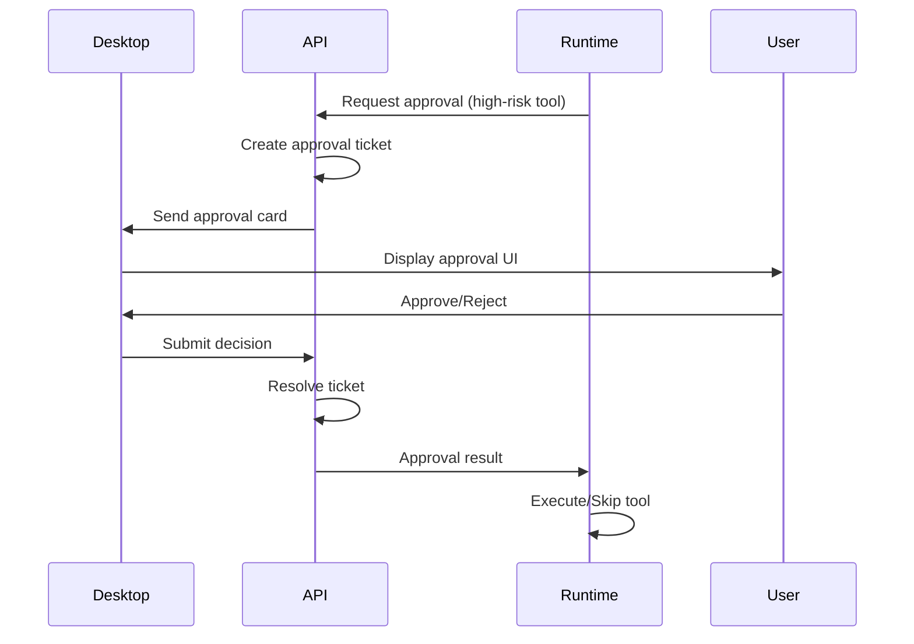

# OpenStaff Monorepo Conventions

**Version**: 0.1  
**Status**: Authoritative  
**Last Updated**: 2026-09-28

---

## Overview

This document defines the authoritative conventions for the OpenStaff monorepo. All code, documentation, and tooling must follow these rules.

---

## Directory Layout

### Root Structure

```
openstaff/
├── apps/               # Application layer (user-facing)
│   ├── desktop/        # Tauri 2 + React - chat-first desktop client
│   └── web-admin/      # React - admin/ops console (NOT full chat)
├── services/           # Backend microservices (Rust)
│   ├── api/            # Control plane API + approval tickets
│   ├── gateway/        # LLM Gateway (sole LLM egress point)
│   └── scheduler/      # Routine scheduler (cron + events)
├── crates/             # Shared Rust libraries
│   ├── protocol/       # ** SOURCE OF TRUTH ** - message types, events
│   └── runtime-agent/  # Agent orchestration runtime
├── packages/           # Shared frontend packages (TypeScript)
│   └── ui/             # (future) Shared React components
├── docs/
│   ├── architecture/   # Architecture decision records
│   └── *.md            # Planning docs (business, product, tech)
├── scripts/            # Development & ops scripts
└── deploy/             # Deployment configurations
    ├── compose/        # Docker Compose (default for local dev)
    └── k8s/            # Kubernetes manifests (provider plugin)
```

### Naming Conventions

- **Services**: `openstaff-{service}` (e.g., `openstaff-api`)
- **Crates**: `openstaff-{name}` (e.g., `openstaff-protocol`)
- **Apps**: `@openstaff/{app}` (e.g., `@openstaff/desktop`)
- **Packages**: `@openstaff/{pkg}` (e.g., `@openstaff/ui`)

---

## Protocol as Source of Truth

### `crates/protocol` - The Contract

All inter-service communication, IPC messages, and data structures are defined in `crates/protocol`. This crate is the **single source of truth** for:

- Message envelopes (`EventEnvelope`, `Message`)
- Agent state types (`AgentProfile`, `AgentStatus`)
- Tool call specifications (`ToolCall`, `ToolResult`)
- Approval requests (`ApprovalRequest`, `ApprovalDecision`)
- Cross-service events (`SendToAgent`, `SendToUser`)

**Rules**:

1. ✅ **Services MUST import `openstaff-protocol`** for all shared types
2. ❌ **Services MUST NOT define their own message types** that duplicate protocol
3. ✅ **Breaking changes REQUIRE protocol version bump**
4. ✅ **Protocol changes MUST be documented in CHANGELOG**

### Example

```rust
// ✅ Good: Using protocol types
use openstaff_protocol::{Message, EventEnvelope, ToolCall};

// ❌ Bad: Redefining types in services
struct Message { content: String } // DON'T DO THIS
```

---

## Service Boundaries

### Control Plane API (`services/api`)

**Responsibilities**:
- Agent CRUD operations
- Session management & routing
- **Approval ticket creation & resolution** (sole owner)
- User authentication & authorization
- Connector configuration (secret vault)

**Does NOT**:
- Call LLMs directly (use Gateway)
- Execute tools directly (delegate to Runtime)
- Manage sandbox lifecycle (use SandboxProvider)

**Ports**: 
- HTTP/WebSocket: `3000` (default)

### LLM Gateway (`services/gateway`)

**Responsibilities**:
- **Sole LLM egress point** (all LLM calls go through here)
- Multi-model routing (OpenAI, Anthropic, etc.)
- Rate limiting & quota management
- Key management (customer keys / hosted keys)
- LLM request/response audit logging

**Does NOT**:
- Make business logic decisions
- Store agent state
- Handle approvals

**Ports**: 
- HTTP: `3001` (default)

### Scheduler (`services/scheduler`)

**Responsibilities**:
- Cron routine execution
- Event-driven triggers (webhooks, file watchers)
- Routine message delivery to control plane

**Does NOT**:
- Execute agent logic directly
- Store routine definitions (control plane owns)

**Ports**: 
- HTTP: `3002` (default)

---

## Application Layer

### Desktop Client (`apps/desktop`)

**Role**: Chat-first stage for user-agent interaction

**Architecture**:
- **Frontend**: React 18 + TypeScript + Vite
- **Backend**: Tauri 2 (Rust) - IPC bridge to control plane
- **Purpose**: 
  - Chat interface (primary)
  - Agent sidebar
  - Approval card UI
  - Local tool execution (post-approval)

**Does NOT**:
- Implement full chat server (connects to API)
- Store agent state locally (cache only)
- Make LLM calls directly (use API → Gateway)

### Web Admin Console (`apps/web-admin`)

**Role**: Admin/ops console (NOT full chat)

**Purpose**:
- Agent management (CRUD, status monitoring)
- Approval policy editor
- Audit log browser
- System health dashboard
- Connector configuration UI

**Does NOT**:
- Provide full chat interface (use Desktop for that)
- Execute agent logic
- Directly call services (all via API)

---

## Approval Flow

**Authoritative Source**: Control Plane API

All approvals follow this flow:



**Rules**:
1. ✅ **API creates ALL approval tickets** (sole owner)
2. ✅ **Desktop renders cards from API data** (no local logic)
3. ❌ **Runtime CANNOT self-approve** (must wait for ticket resolution)
4. ✅ **All approval decisions logged** (audit trail)

---

## Sandbox Strategy

### Default: Clean Open Source

The monorepo ships with a **clean, open-source sandbox strategy**:

- **Local dev**: Docker Compose (`deploy/compose/`)
- **Production**: Kubernetes manifests (`deploy/k8s/`)
- **No proprietary dependencies**: OpenClaw STS+PVC optional

### SandboxProvider Plugin Architecture

For organizations with existing infrastructure (e.g., OpenClaw), sandboxes are **pluggable**:

```rust
// Protocol defines the interface
pub trait SandboxProvider {
    async fn create_sandbox(&self, agent_id: &str) -> Result<Sandbox>;
    async fn destroy_sandbox(&self, sandbox_id: &str) -> Result<()>;
    // ... more methods
}

// Implementations:
// - ComposeSandboxProvider (default, open source)
// - K8sSandboxProvider (open source)
// - OpenClawSandboxProvider (optional, proprietary plugin)
```

**Rules**:
1. ✅ **Default provider uses Docker Compose** (no external deps)
2. ✅ **K8s provider uses standard StatefulSet + PVC** (open source)
3. ✅ **OpenClaw integration is OPTIONAL** (plugin, not default)
4. ❌ **Core repo MUST NOT require proprietary SandboxProvider**

---

## Local Development: `just dev` Dependency Order

### Startup Sequence

```bash
just dev
```

**Order** (services start in this sequence):

1. **Gateway** (`openstaff-gateway`) - Port 3001
   - No dependencies
   - Starts first (LLM calls ready)

2. **Scheduler** (`openstaff-scheduler`) - Port 3002
   - No dependencies
   - Can start in parallel with Gateway

3. **API** (`openstaff-api`) - Port 3000
   - Depends on: Gateway (for LLM calls)
   - Starts after Gateway is healthy

**Frontend apps** (manual start, after backend is ready):

```bash
# Desktop (Tauri + React)
cd apps/desktop && pnpm dev  # Port 5173

# Web Admin
cd apps/web-admin && pnpm dev  # Port 5174
```

### Health Check Flow

```bash
# Check if services are ready
just health

# Expected output:
# ✅ Gateway (3001): healthy
# ✅ Scheduler (3002): healthy
# ✅ API (3000): healthy
```

### Docker Compose (Alternative)

For full-stack local dev with sandboxes:

```bash
cd deploy/compose
docker-compose up

# Includes:
# - All backend services
# - Postgres (control plane state)
# - Redis (session cache)
# - Agent sandbox template
```

---

## Testing Strategy

### Unit Tests

- **Crates**: `cargo test -p openstaff-protocol`
- **Services**: `cargo test -p openstaff-api`
- **Frontend**: `pnpm test` (per-app)

### Integration Tests

- **Service-to-service**: `tests/integration/`
- **E2E**: `tests/e2e/` (Playwright for desktop/admin)

### Contract Tests

- **Protocol**: Versioned JSON schemas in `crates/protocol/schemas/`
- **API**: OpenAPI spec generated from code
- **Gateway**: Mock LLM provider for tests

---

## Deployment Topology

### Local Development

```
Developer Machine
├── Backend services (Rust binaries)
│   ├── API: localhost:3000
│   ├── Gateway: localhost:3001
│   └── Scheduler: localhost:3002
├── Desktop app (Tauri)
│   └── localhost:5173 (Vite dev server)
└── Web admin (React)
    └── localhost:5174 (Vite dev server)
```

### Docker Compose (Local with Sandboxes)

```
Docker Compose
├── openstaff-api
├── openstaff-gateway
├── openstaff-scheduler
├── postgres (control plane DB)
├── redis (session cache)
└── agent-sandbox-* (per-agent containers)
```

### Kubernetes (Production)

```
Kubernetes Cluster
├── Namespace: openstaff-control-plane
│   ├── Deployment: api (replicas: 3)
│   ├── Deployment: gateway (replicas: 5)
│   └── Deployment: scheduler (replicas: 2)
├── Namespace: openstaff-agents
│   └── StatefulSet: agent-{id} (replicas: 1, PVC per agent)
└── Ingress: TLS termination + routing
```

---

## Code Quality Gates

### Pre-commit (Recommended)

```bash
just format    # cargo fmt + prettier
just lint      # clippy + eslint
just test      # all tests
```

### CI Pipeline (GitHub Actions)

1. **Check**: `cargo check --workspace`
2. **Test**: `cargo test --workspace`
3. **Lint**: `cargo clippy -- -D warnings`
4. **Format**: `cargo fmt --check`
5. **Frontend**: `pnpm type-check && pnpm lint`

---

## Breaking Change Policy

### When Protocol Changes

1. **Bump protocol version** in `Cargo.toml`
2. **Update CHANGELOG.md** with migration guide
3. **Ensure backward compatibility** (if possible)
4. **Coordinate service updates** (API, Gateway, Scheduler)

### Versioning Scheme

- **Protocol**: Semantic versioning (`0.1.0` → `0.2.0` for breaking)
- **Services**: Can lag behind protocol (backward compat layer)
- **Apps**: Follow service API versions

---

## Security Boundaries

### Secrets

- **API keys**: Stored in control plane DB (encrypted at rest)
- **User credentials**: Never logged, never in protocol messages
- **Local tools**: Require approval tickets (no silent execution)

### Network Policies

- **Gateway**: Only service allowed to egress to LLM APIs
- **Sandboxes**: NetworkPolicy restricts egress (whitelist only)
- **API**: Rate-limited per user/agent

---

## Future: Plugin Architecture

### Planned Plugin Points

1. **SandboxProvider** (already designed)
2. **LLMProvider** (custom model integrations)
3. **SkillLoader** (third-party skills)
4. **ConnectorRegistry** (MCP extensions)

### Plugin Isolation

- Plugins run in separate process (IPC boundary)
- Crash isolation (plugin crash ≠ service crash)
- Resource limits (CPU/memory quotas)

---

## References

- [Architecture Overview](../architecture.md)
- [Tech Plan v0.1](../2026-09-28-openstaff-tech-plan-v0.1_f5ef.md)
- [AGENTS.md](../../AGENTS.md) - Agent development guidelines

---

**Authoritative Status**: This document supersedes any conflicting guidance in other docs. When in doubt, follow this spec.
